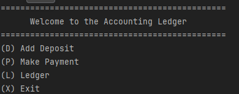
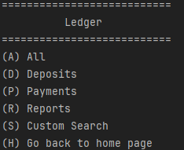
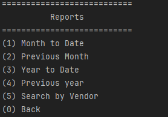

# my account ledger
___
## Home Screen 
once you run the application you are prompted with the home screen.
from here you can enter any of these options

* (D) - to make a deposit
  * enter the questions that you are prompted with to add your deposit
* (P) - to make a payment
*  * enter the questions that you are prompted with to add your payment
* (L) - to open up the ledger screen 
  * brings you to the ledger menu
* (X) - to exit program
___

## Ledger Screen

Once you open this screen you are prompted with the ledger screen you
can enter any of these options

* (A) - to display all transactions
  * displays a screen that shows all your transactions
* (D) - to display all deposit
  * if you select "D" you can get a screen that displays all your deposits
* (P) - to display all payments
  * if you select "P" you can get a display that shows all of your payments
* (R) - to display different reports
  * displays the reports menu 
* (S) - to enter a custom search of all your transactions
  * you can enter all the questions that you are prompted with to find exactly what you are looking for.
* (H) - to go back to the home screen
___

## Reports menu

once you open the reports menu you are able to determine what report you would like

